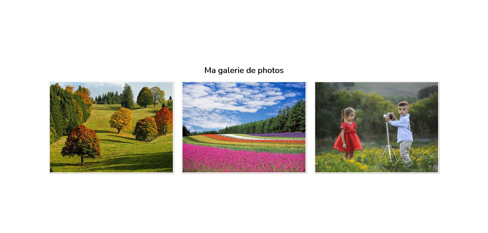

# Cards

## Objectif
Vous devez réaliser une galerie d'images avec des cards comme indiqué dans les captures ci-dessous.

Pour l'effet de survol, voir la vidéo survol.mp4

## Résultat

Stocker l'ensemble de vos codes soit sur un dépôt GIT ou sur CodePen au choix.
